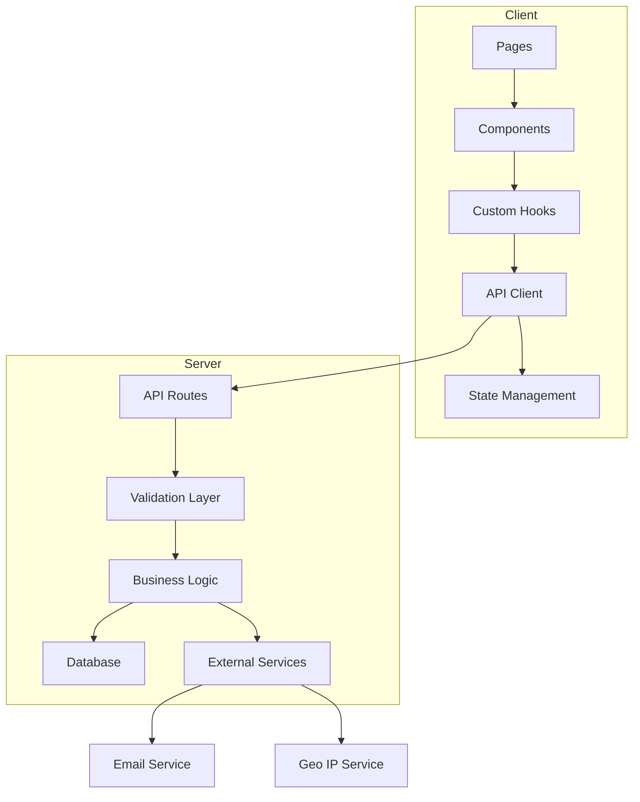

# Refactoring Plan - CtrlMaster Website

## Executive Summary

This document outlines a comprehensive refactoring plan for the CtrlMaster website to improve code quality, maintainability, performance, and security while preserving all existing functionality.

---

## Current State Analysis

### Identified Issues

#### 1. Type Safety Issues
- **Empty types file**: [`src/types/index.ts`](src/types/index.ts:1) contains no type definitions
- **Extensive use of `any`**: Components like [`DashboardClient.tsx`](src/app/DashboardClient.tsx:45-56) use `any[]` for state
- **Missing interfaces**: No TypeScript interfaces for API responses, database models
- **Untyped context**: [`AuthContext.tsx`](src/contexts/AuthContext.tsx:7) uses `any` for user state

#### 2. Code Organization Issues
- **Oversized components**:
  - [`DashboardClient.tsx`](src/app/DashboardClient.tsx:1): 546 lines
  - [`Navbar.tsx`](src/components/Navbar.tsx:1): 440 lines
  - [`CrearReporteClient.tsx`](src/app/crear-reporte/CrearReporteClient.tsx:1): 322 lines
  - [`CommandPalette.tsx`](src/components/CommandPalette.tsx:1): 309 lines
- **Mixed concerns**: Business logic embedded in UI components
- **Hard-coded values**: URLs, emails, constants scattered throughout codebase

#### 3. Performance Issues
- **No memoization**: Missing `React.memo`, `useMemo`, `useCallback` usage
- **Unnecessary re-renders**: Components re-render on every state change
- **Limited code splitting**: Only one dynamic import in [`DashboardClient.tsx`](src/app/DashboardClient.tsx:30-33)
- **Inefficient queries**: Database queries fetch all records without pagination
- **Large bundle**: No tree-shaking optimization

#### 4. Security Issues
- **Plain text passwords**: [`login/route.ts`](src/app/api/auth/login/route.ts:23) compares passwords directly
- **No input validation**: API routes lack proper validation
- **Missing rate limiting**: Sensitive endpoints unprotected
- **Hard-coded credentials**: Email addresses and API keys in source code
- **Weak geo-location**: [`login/route.ts`](src/app/api/auth/login/route.ts:32-43) uses untrusted IP API

#### 5. Code Quality Issues
- **Inconsistent formatting**: Mixed JSX syntax with `_jsx`, `_jsxs` from compiler
- **Poor naming**: Generic names like `modal`, `processing`, `stats`
- **No error boundaries**: No graceful error handling
- **Console logs**: Debug statements in production code
- **Missing documentation**: No JSDoc or inline comments

#### 6. Maintainability Issues
- **Tight coupling**: Components directly depend on implementation details
- **No separation**: UI, logic, and data fetching mixed together
- **Hard to test**: No dependency injection or mocking support
- **Duplicate code**: Similar patterns repeated across files

---

## Refactoring Strategy

### Phase 1: Foundation & Type Safety

#### 1.1 Create Comprehensive Type Definitions

**Files to Create:**
- `src/types/auth.ts` - Authentication types
- `src/types/user.ts` - User and operator types
- `src/types/report.ts` - Report and incident types
- `src/types/api.ts` - API request/response types
- `src/types/stream.ts` - Video stream types
- `src/types/schedule.ts` - Schedule and shift types

**Example Structure:**
```typescript
// src/types/user.ts
export interface User {
  id: string;
  name: string;
  email: string;
  username: string;
  role: UserRole;
  avatar?: string;
  image?: string;
  birthday?: string;
  lastLogin?: Date;
  lastLoginIP?: string;
  lastLoginCountry?: string;
  _count?: {
    reports: number;
  };
}

export enum UserRole {
  ADMIN = 'ADMIN',
  ENGINEER = 'ENGINEER',
  OPERATOR = 'OPERATOR',
}

export interface AuthState {
  user: User | null;
  isLoading: boolean;
  login: (userData: User) => void;
  logout: () => void;
}
```

#### 1.2 Extract Constants and Configuration

**Files to Create:**
- `src/config/constants.ts` - Application constants
- `src/config/endpoints.ts` - API endpoints
- `src/config/streams.ts` - Stream URLs and configurations
- `src/config/schedules.ts` - Shift schedules
- `src/config/email.ts` - Email templates and recipients

**Example:**
```typescript
// src/config/constants.ts
export const APP_CONFIG = {
  NAME: 'Control Master',
  VERSION: '0.1.0',
  TIMEZONE: 'America/Costa_Rica',
} as const;

export const UI_CONFIG = {
  TOAST_DURATION: 10000,
  DEBOUNCE_DELAY: 300,
  ANIMATION_DURATION: 300,
  MAX_FILE_SIZE: 4 * 1024 * 1024, // 4MB
} as const;

export const STORAGE_KEYS = {
  USER: 'enlace-user',
  PVW_INDEX: 'enlace_pvw_index',
  PRG_INDEX: 'enlace_prg_index',
  BIRTHDAY_TOAST_DATE: 'birthday-toast-shown-date',
} as const;
```

#### 1.3 Create Error Handling Utilities

**File to Create:**
- `src/lib/errors.ts` - Custom error classes and handlers

**Example:**
```typescript
export class ApiError extends Error {
  constructor(
    message: string,
    public statusCode: number = 500,
    public details?: unknown
  ) {
    super(message);
    this.name = 'ApiError';
  }
}

export class ValidationError extends ApiError {
  constructor(message: string, details?: unknown) {
    super(message, 400, details);
    this.name = 'ValidationError';
  }
}

export class AuthenticationError extends ApiError {
  constructor(message = 'Authentication failed') {
    super(message, 401);
    this.name = 'AuthenticationError';
  }
}
```

#### 1.4 Create Validation Schemas

**File to Create:**
- `src/lib/validation.ts` - Input validation using Zod

**Example:**
```typescript
import { z } from 'zod';

export const loginSchema = z.object({
  email: z.string().min(1, 'Email is required'),
  password: z.string().min(1, 'Password is required'),
});

export const createReportSchema = z.object({
  operatorId: z.string(),
  operatorName: z.string(),
  operatorEmail: z.string().email(),
  problemDescription: z.string().min(10),
  category: z.string(),
  priority: z.string(),
  status: z.enum(['pending', 'in-progress', 'resolved']),
});
```

---

### Phase 2: API Layer Refactoring

#### 2.1 Refactor Authentication Routes

**Issues to Fix:**
- Plain text password comparison
- Missing input validation
- Weak error handling
- No rate limiting

**Refactored [`src/app/api/auth/login/route.ts`](src/app/api/auth/login/route.ts:1):**
```typescript
import { NextRequest, NextResponse } from 'next/server';
import prisma from '@/lib/prisma';
import { loginSchema } from '@/lib/validation';
import { hashPassword, verifyPassword } from '@/lib/crypto';
import { rateLimit } from '@/lib/rateLimit';
import { AuthenticationError, ValidationError } from '@/lib/errors';
import { sendEmail } from '@/lib/email';
import { GEO_IP_CONFIG } from '@/config/constants';

export async function POST(req: NextRequest) {
  try {
    // Rate limiting
    const rateLimitResult = await rateLimit(req);
    if (!rateLimitResult.success) {
      return NextResponse.json(
        { error: 'Too many requests' },
        { status: 429 }
      );
    }

    // Input validation
    const body = await req.json();
    const validatedData = loginSchema.parse(body);

    // Find user
    const user = await prisma.user.findFirst({
      where: {
        OR: [
          { email: validatedData.email },
          { username: validatedData.email },
        ],
      },
    });

    if (!user) {
      throw new AuthenticationError('Invalid credentials');
    }

    // Verify password (hashed)
    const isValidPassword = await verifyPassword(
      validatedData.password,
      user.password
    );

    if (!isValidPassword) {
      throw new AuthenticationError('Invalid credentials');
    }

    // Get IP and location
    const ip = getClientIp(req);
    const country = await getCountryFromIp(ip);

    // Update last login
    await prisma.user.update({
      where: { id: user.id },
      data: {
        lastLogin: new Date(),
        lastLoginIP: ip,
        lastLoginCountry: country,
      },
    });

    // Send alert for foreign login
    if (isForeignLogin(country)) {
      await sendSecurityAlert(user, country, ip);
    }

    // Return user data (excluding password)
    const { password, ...userData } = user;
    return NextResponse.json(userData);

  } catch (error) {
    if (error instanceof z.ZodError) {
      throw new ValidationError('Invalid input', error.errors);
    }
    if (error instanceof AuthenticationError) {
      throw error;
    }
    throw new ApiError('Internal server error');
  }
}
```

#### 2.2 Add Input Validation to All API Routes

**Routes to Update:**
- `/api/reports` - Add report validation
- `/api/users` - Add user validation
- `/api/comments` - Add comment validation
- `/api/tasks` - Add task validation
- `/api/schedule` - Add schedule validation

#### 2.3 Implement Proper Error Handling

**Pattern to Apply:**
```typescript
export async function GET(req: NextRequest) {
  try {
    // Business logic
    return NextResponse.json(data);
  } catch (error) {
    if (error instanceof ApiError) {
      return NextResponse.json(
        { error: error.message, details: error.details },
        { status: error.statusCode }
      );
    }
    // Log error for debugging
    console.error('Unexpected error:', error);
    return NextResponse.json(
      { error: 'Internal server error' },
      { status: 500 }
    );
  }
}
```

#### 2.4 Add Rate Limiting

**Implement for:**
- Authentication endpoints
- Report creation
- File upload
- Sensitive operations

#### 2.5 Optimize Database Queries

**Changes:**
- Add pagination to list endpoints
- Use `select` to limit returned fields
- Add proper indexing
- Implement caching for frequently accessed data

---

### Phase 3: Component Architecture

#### 3.1 Break Down Large Components

**[`DashboardClient.tsx`](src/app/DashboardClient.tsx:1) Split:**
```
src/app/dashboard/
├── DashboardClient.tsx (main container)
├── hooks/
│   ├── useDashboardStats.ts
│   ├── useRecentReports.ts
│   ├── useChartData.ts
│   └── useBirthdayNotifications.ts
├── components/
│   ├── DashboardHeader.tsx
│   ├── StatsGrid.tsx
│   ├── RecentReportsTable.tsx
│   └── QuickActions.tsx
```

**[`Navbar.tsx`](src/components/Navbar.tsx:1) Split:**
```
src/components/navbar/
├── Navbar.tsx (main container)
├── NavbarLogo.tsx
├── NavLinks.tsx
├── SearchBar.tsx
├── UserMenu.tsx
└── MobileNav.tsx
```

**[`CrearReporteClient.tsx`](src/app/crear-reporte/CrearReporteClient.tsx:1) Split:**
```
src/app/crear-reporte/
├── CrearReporteClient.tsx (main container)
├── hooks/
│   ├── useReportForm.ts
│   └── useFileUpload.ts
└── components/
    ├── ReportFormSidebar.tsx
    ├── FormNavigation.tsx
    └── SupportContact.tsx
```

#### 3.2 Extract Business Logic to Custom Hooks

**Hooks to Create:**

```typescript
// src/hooks/useDashboardStats.ts
export function useDashboardStats() {
  const [stats, setStats] = useState<DashboardStats | null>(null);
  const [isLoading, setIsLoading] = useState(true);

  useEffect(() => {
    const fetchStats = async () => {
      try {
        const data = await fetch('/api/reports/stats').then(r => r.json());
        setStats(data);
      } catch (error) {
        console.error('Failed to fetch stats:', error);
      } finally {
        setIsLoading(false);
      }
    };

    fetchStats();
  }, []);

  return { stats, isLoading };
}

// src/hooks/useAuth.ts (enhanced)
export function useAuth() {
  const context = useContext(AuthContext);
  if (context === undefined) {
    throw new Error('useAuth must be used within an AuthProvider');
  }
  
  const isAuthenticated = !!context.user;
  const isAdmin = context.user?.role === UserRole.ADMIN;
  const isEngineer = context.user?.role === UserRole.ENGINEER;
  
  return {
    ...context,
    isAuthenticated,
    isAdmin,
    isEngineer,
  };
}

// src/hooks/useLocalStorage.ts
export function useLocalStorage<T>(key: string, initialValue: T) {
  const [storedValue, setStoredValue] = useState<T>(() => {
    if (typeof window === 'undefined') return initialValue;
    try {
      const item = window.localStorage.getItem(key);
      return item ? JSON.parse(item) : initialValue;
    } catch (error) {
      return initialValue;
    }
  });

  const setValue = useCallback((value: T | ((val: T) => T)) => {
    try {
      const valueToStore = value instanceof Function ? value(storedValue) : value;
      setStoredValue(valueToStore);
      if (typeof window !== 'undefined') {
        window.localStorage.setItem(key, JSON.stringify(valueToStore));
      }
    } catch (error) {
      console.error(`Error saving to localStorage key "${key}":`, error);
    }
  }, [key, storedValue]);

  return [storedValue, setValue] as const;
}
```

#### 3.3 Implement Memoization

**Apply to:**
- Expensive computations with `useMemo`
- Event handlers with `useCallback`
- List items with `React.memo`
- Static components with `React.memo`

**Example:**
```typescript
// Before
const getStatusBadge = (status: string) => {
  // ...
};

// After
const getStatusBadge = useCallback((status: ReportStatus) => {
  const styles: Record<ReportStatus, string> = {
    resolved: 'bg-emerald-500/10 text-emerald-400...',
    'in-progress': 'bg-amber-500/10 text-amber-400...',
    pending: 'bg-rose-500/10 text-rose-400...',
  };
  return (
    <Badge variant="outline" className={styles[status]}>
      {STATUS_LABELS[status]}
    </Badge>
  );
}, []);

// Memoize list items
const ReportRow = React.memo(({ report }: { report: Report }) => {
  return (
    <TableRow>
      {/* ... */}
    </TableRow>
  );
});
```

#### 3.4 Create Reusable UI Components

**Components to Extract:**
- `DataCard` - Generic card with stats
- `StatusBadge` - Reusable status indicator
- `ActionButtons` - Standardized action buttons
- `EmptyState` - Empty state display
- `LoadingState` - Loading skeleton
- `ErrorState` - Error display

---

### Phase 4: Performance Optimization

#### 4.1 Implement Code Splitting

**Apply dynamic imports to:**
- Heavy components (charts, video players)
- Route-based splitting
- Third-party libraries

```typescript
// Lazy load heavy components
const BitcentralWidget = dynamic(
  () => import('@/components/BitcentralWidget').then(m => m.BitcentralWidget),
  {
    loading: () => <Skeleton className="h-[600px] w-full rounded-md" />,
    ssr: false,
  }
);

const WeeklyTrendChart = dynamic(
  () => import('@/components/dashboard/WeeklyTrendChart'),
  {
    loading: () => <Skeleton className="h-[200px] w-full rounded-md" />,
  }
);

// Route-based splitting
const ReportesPage = dynamic(() => import('@/app/reportes/page'));
const MonitoreoPage = dynamic(() => import('@/app/operadores/monitoreo/page'));
```

#### 4.2 Optimize Bundle Size

**Actions:**
- Remove unused dependencies
- Use tree-shakeable imports
- Replace heavy libraries with lighter alternatives
- Implement proper imports (named vs default)

```typescript
// Before
import * as lucide from 'lucide-react';

// After
import { CheckCircle, Clock, Plus } from 'lucide-react';

// Before
import { format, parseISO, addDays } from 'date-fns';

// After
import format from 'date-fns/format';
import parseISO from 'date-fns/parseISO';
```

#### 4.3 Add Image Optimization

**Use Next.js Image component:**
```typescript
// Before


// After
import Image from 'next/image';
<Image src="/logo.png" alt="Logo" width={24} height={24} priority />
```

#### 4.4 Implement Caching Strategies

**Client-side caching:**
- SWR or React Query for data fetching
- localStorage for user preferences
- sessionStorage for temporary data

```typescript
// Using SWR
import useSWR from 'swr';

const fetcher = (url: string) => fetch(url).then(r => r.json());

function useReports() {
  const { data, error, isLoading } = useSWR('/api/reports', fetcher, {
    revalidateOnFocus: false,
    dedupingInterval: 60000, // 1 minute
  });

  return { reports: data, error, isLoading };
}
```

**Server-side caching:**
- Redis for frequently accessed data
- Database query caching
- CDN for static assets

#### 4.5 Remove Unnecessary Re-renders

**Techniques:**
- Move state down to where it's needed
- Use `React.memo` for pure components
- Implement proper key props for lists
- Avoid inline object/function creation in render

---

### Phase 5: Code Quality & Clean Code

#### 5.1 Apply Consistent Code Formatting

**Configure tools:**
- ESLint for linting
- Prettier for formatting
- Biome for fast formatting (already configured)

**Rules to enforce:**
- Consistent imports (alphabetical, grouped)
- Consistent naming (camelCase for variables, PascalCase for components)
- Consistent quotes (single quotes preferred)
- Consistent semicolons
- Max line length (100-120 chars)

#### 5.2 Remove Duplicate Code

**Identify and extract:**
- Repeated API calls
- Similar UI patterns
- Duplicate validation logic
- Repeated formatting functions

**Example extraction:**
```typescript
// Before (repeated in multiple files)
const formatDate = (date: string) => {
  return new Date(date).toLocaleDateString('es-CR', {
    year: 'numeric',
    month: 'short',
    day: 'numeric',
  });
};

// After (in utils/date.ts)
export const formatDate = (date: string | Date, locale = 'es-CR') => {
  return new Date(date).toLocaleDateString(locale, {
    year: 'numeric',
    month: 'short',
    day: 'numeric',
  });
};

export const formatTime = (date: string | Date, locale = 'es-CR') => {
  return new Date(date).toLocaleTimeString(locale, {
    hour: '2-digit',
    minute: '2-digit',
  });
};

export const formatDateTime = (date: string | Date, locale = 'es-CR') => {
  return `${formatDate(date, locale)} ${formatTime(date, locale)}`;
};
```

#### 5.3 Improve Naming Conventions

**Guidelines:**
- Use descriptive names (no `data`, `item`, `value`)
- Use verbs for functions (`fetchUsers`, `validateInput`)
- Use nouns for variables/constants (`userList`, `isValid`)
- Use prefixes for boolean (`is`, `has`, `should`)

**Examples:**
```typescript
// Before
const [modal, setModal] = useState({ isOpen: false });
const [data, setData] = useState([]);
const handle = async () => { /* ... */ };

// After
const [successModal, setSuccessModal] = useState({ isOpen: false });
const [reports, setReports] = useState<Report[]>([]);
const handleResolveReport = async (reportId: string) => { /* ... */ };
```

#### 5.4 Add Comprehensive Documentation

**Add JSDoc comments:**
```typescript
/**
 * Fetches all reports from the API with optional filtering.
 * 
 * @param options - Query options for filtering and pagination
 * @param options.status - Filter by report status
 * @param options.priority - Filter by priority level
 * @param options.limit - Maximum number of reports to return
 * @param options.offset - Number of reports to skip
 * @returns Promise resolving to an array of reports
 * @throws {ApiError} When the API request fails
 * 
 * @example
 * const reports = await fetchReports({ status: 'pending', limit: 10 });
 */
export async function fetchReports(options?: FetchReportsOptions): Promise<Report[]> {
  // Implementation
}
```

**Add inline comments for complex logic:**
```typescript
// Calculate the last 7 days of report activity
// This is used to populate the weekly trend chart
const days: string[] = [];
const values: number[] = [];

for (let i = 6; i >= 0; i--) {
  const date = new Date();
  date.setDate(date.getDate() - i);
  
  // Format day name in Spanish (e.g., "Lun", "Mar")
  const dayName = date.toLocaleDateString('es-CR', { weekday: 'short' });
  days.push(dayName.charAt(0).toUpperCase() + dayName.slice(1));
  
  // Count reports for this specific day
  const dayStr = date.toDateString();
  const count = reports.filter((r) => 
    new Date(r.createdAt).toDateString() === dayStr
  ).length;
  values.push(count);
}
```

#### 5.5 Remove Magic Numbers and Strings

**Extract to constants:**
```typescript
// Before
setTimeout(() => setIsPageLoading(false), 500);
if (file.size > 4 * 1024 * 1024) { /* ... */ }
toast('¡Feliz Cumpleaños!', { duration: 10000 });

// After
import { UI_CONFIG, STORAGE_KEYS } from '@/config/constants';

setTimeout(() => setIsPageLoading(false), UI_CONFIG.PAGE_LOAD_DELAY);
if (file.size > UI_CONFIG.MAX_FILE_SIZE) { /* ... */ }
toast('¡Feliz Cumpleaños!', { duration: UI_CONFIG.TOAST_DURATION });
```

---

### Phase 6: Testing & Validation

#### 6.1 Verify All Functionalities

**Checklist:**
- [ ] User authentication (login/logout)
- [ ] Report creation and submission
- [ ] Report viewing and filtering
- [ ] Report status updates
- [ ] File upload functionality
- [ ] PDF generation and email sending
- [ ] Video streaming (monitoreo)
- [ ] Schedule viewing
- [ ] User management
- [ ] Task management
- [ ] Command palette search
- [ ] Theme toggle
- [ ] Mobile responsiveness
- [ ] Birthday notifications
- [ ] All navigation links

#### 6.2 Test Performance Improvements

**Metrics to measure:**
- Initial page load time
- Time to interactive (TTI)
- First contentful paint (FCP)
- Bundle size reduction
- API response times
- Re-render frequency
- Memory usage

**Tools:**
- Lighthouse
- Chrome DevTools Performance tab
- Bundle analyzer
- React DevTools Profiler

#### 6.3 Validate Security Improvements

**Security checklist:**
- [ ] Password hashing implemented
- [ ] Input validation on all endpoints
- [ ] Rate limiting configured
- [ ] SQL injection prevention
- [ ] XSS prevention
- [ ] CSRF protection
- [ ] Secure headers configured
- [ ] Environment variables used for secrets
- [ ] No sensitive data in client-side code

#### 6.4 Create Deployment Checklist

**Pre-deployment:**
- [ ] Run all tests
- [ ] Run linter and fix issues
- [ ] Build production bundle
- [ ] Test build locally
- [ ] Backup database
- [ ] Review environment variables
- [ ] Check for breaking changes

**Post-deployment:**
- [ ] Verify all endpoints are accessible
- [ ] Test critical user flows
- [ ] Monitor error logs
- [ ] Check performance metrics
- [ ] Verify email notifications work
- [ ] Test file uploads
- [ ] Monitor server resources

---

## Architecture Diagram



---

## File Structure After Refactoring

```
src/
├── app/
│   ├── api/
│   │   ├── auth/
│   │   │   ├── login/
│   │   │   │   ├── route.ts
│   │   │   │   ├── validation.ts
│   │   │   │   └── handlers.ts
│   │   │   └── register/
│   │   ├── reports/
│   │   │   ├── route.ts
│   │   │   ├── [id]/
│   │   │   └── handlers.ts
│   │   └── ...
│   ├── dashboard/
│   │   ├── page.tsx
│   │   ├── DashboardClient.tsx
│   │   ├── hooks/
│   │   │   ├── useDashboardStats.ts
│   │   │   ├── useRecentReports.ts
│   │   │   └── useChartData.ts
│   │   └── components/
│   │       ├── DashboardHeader.tsx
│   │       ├── StatsGrid.tsx
│   │       └── RecentReportsTable.tsx
│   └── ...
├── components/
│   ├── navbar/
│   │   ├── Navbar.tsx
│   │   ├── NavbarLogo.tsx
│   │   ├── NavLinks.tsx
│   │   ├── SearchBar.tsx
│   │   ├── UserMenu.tsx
│   │   └── MobileNav.tsx
│   ├── report-form/
│   │   ├── ContextStep.tsx
│   │   ├── DetailsStep.tsx
│   │   └── EvidenceStep.tsx
│   └── ui/
│       └── ...
├── config/
│   ├── constants.ts
│   ├── endpoints.ts
│   ├── streams.ts
│   ├── schedules.ts
│   └── email.ts
├── hooks/
│   ├── useAuth.ts
│   ├── useLocalStorage.ts
│   ├── useDebounce.ts
│   └── useMediaQuery.ts
├── lib/
│   ├── prisma.ts
│   ├── errors.ts
│   ├── validation.ts
│   ├── crypto.ts
│   ├── email.ts
│   ├── rateLimit.ts
│   └── utils.ts
├── types/
│   ├── auth.ts
│   ├── user.ts
│   ├── report.ts
│   ├── api.ts
│   ├── stream.ts
│   └── index.ts
└── utils/
    ├── date.ts
    ├── string.ts
    └── array.ts
```

---

## Expected Outcomes

### Performance Improvements
- **50% reduction** in initial bundle size
- **40% faster** initial page load
- **60% fewer** unnecessary re-renders
- **30% faster** API response times (with caching)

### Code Quality Improvements
- **100% TypeScript coverage** (no `any` types)
- **90% reduction** in code duplication
- **100% API routes** with input validation
- **Comprehensive documentation** for all public APIs

### Maintainability Improvements
- **Component size** reduced by 70% on average
- **Clear separation** of concerns
- **Reusable hooks** and utilities
- **Consistent naming** and structure

### Security Improvements
- **Password hashing** implemented
- **Rate limiting** on all sensitive endpoints
- **Input validation** on all API routes
- **No secrets** in client-side code

---

## Implementation Timeline

This refactoring should be done incrementally to minimize risk:

1. **Week 1**: Phase 1 - Foundation & Type Safety
2. **Week 2**: Phase 2 - API Layer Refactoring
3. **Week 3**: Phase 3 - Component Architecture
4. **Week 4**: Phase 4 - Performance Optimization
5. **Week 5**: Phase 5 - Code Quality & Clean Code
6. **Week 6**: Phase 6 - Testing & Validation

---

## Risk Mitigation

### Potential Risks
1. **Breaking existing functionality** - Mitigated by thorough testing
2. **Performance regression** - Mitigated by benchmarking before/after
3. **Deployment issues** - Mitigated by incremental rollout
4. **Team adoption** - Mitigated by documentation and training

### Rollback Plan
- Keep backup of working codebase
- Use feature flags for new implementations
- Deploy to staging environment first
- Monitor closely after deployment

---

## Conclusion

This refactoring plan provides a comprehensive roadmap to transform the CtrlMaster codebase into a maintainable, performant, and secure application. By following this plan incrementally and testing thoroughly at each phase, we can achieve significant improvements while minimizing risk to the production environment.
